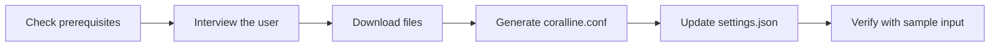

# coralline — AI Installation Playbook

> **You are an AI coding assistant** (Claude Code or similar) and a user asked you to install
> coralline. Follow this playbook top to bottom. Do not skip the interview step — letting the
> user pick their own colors and layout is the whole point of this installer.

## Overview

coralline is a powerline-style statusline for Claude Code. Installation means placing two files
and registering the script in `settings.json`:

| Artifact | Destination | Purpose |
|---|---|---|
| `statusline.sh` | `~/.claude/coralline/statusline.sh` | The statusline renderer |
| `themes/<chosen>.conf` | `~/.claude/coralline/themes/<chosen>.conf` | Color palette |
| generated config | `~/.claude/coralline.conf` | User's layout + theme choices |
| `statusLine` entry | `~/.claude/settings.json` | Registers the script |



## Step 1 — Check prerequisites

```bash
command -v jq || echo "MISSING: jq"
command -v git && bash --version | head -1
```

> **Note:** `jq` is required. If missing, offer to install it (`brew install jq` on macOS,
> `apt/dnf install jq` on Linux) before continuing. `git` is optional — the git segment
> silently disappears without it.

## Step 2 — Interview the user

Use your interactive question tool (e.g. `AskUserQuestion`). If you have no such tool, ask in
plain text and wait for answers. Ask these four questions — include the preview blocks so the
user can compare themes visually:

### Question 1 · Theme

| Option | Palette |
|---|---|
| `claude-coral` | steel blue · mauve · coral (default) |
| `catppuccin-mocha` | pastel blue · green · mauve on dark |
| `nord` | frost cyan · green · purple, arctic tones |
| `gruvbox-dark` | retro blue · aqua · orange, warm cream text |
| `tokyo-night` | neon blue · green · purple on deep navy |
| `mono` | grayscale, minimalist |

Use ASCII previews shaped like the real bar, for example:

```text
claude-coral:     ~/proj  ⎇ main  ◆ Fable 5  ⬡ ▰▰▰▱▱ 62%  ⊙ 2:45 pm
tokyo-night:      ~/proj  ⎇ main  ◆ Fable 5  ⬡ ▰▰▰▱▱ 62%  ⊙ 2:45 pm
```

### Question 2 · Segments (multi-select)

| Segment | Shows | Default |
|---|---|---|
| `dir` | current directory (shortened) | on |
| `git` | branch, dirty marks `+!?`, ahead/behind `⇡⇣` | on |
| `model` | active Claude model | on |
| `ctx` | context-window gauge + token counts | on |
| `limit5h` / `limit7d` | rate-limit gauges with reset countdown | on |
| `cost` | session cost in USD | on |
| `clock` | current time | on |
| `lines` | lines added/removed this session | off |
| `style` | active output style | off |
| `duration` | session wall-clock duration | off |
| `stash` | git stash count | off |

### Question 3 · Layout

| Option | Config to write |
|---|---|
| Responsive (recommended) | `VL_LAYOUT="auto"` — one line when wide, wraps into `VL_MAX_LINES` rows when the window narrows; ask 2 or 3 as the cap |
| Always single line | `VL_LAYOUT="auto"` + `VL_MAX_LINES=1` |
| Fixed two lines | `VL_LAYOUT="fixed"` — path/git/model in `VL_SEGMENTS`, gauges in `VL_SEGMENTS2` |
| Fixed three lines | `VL_LAYOUT="fixed"` + `VL_SEGMENTS3` |

### Question 4 · Details

Ask about: clock format (`12h` / `24h` / `off`), and whether their terminal uses a
**Nerd Font** (if not, set `VL_ASCII=1` so no broken glyphs appear).

## Step 3 — Download the files

```bash
mkdir -p ~/.claude/coralline/themes
BASE="https://raw.githubusercontent.com/Nanako0129/coralline/main"
curl -fsSL "$BASE/statusline.sh"            -o ~/.claude/coralline/statusline.sh
curl -fsSL "$BASE/themes/<CHOSEN>.conf"     -o ~/.claude/coralline/themes/<CHOSEN>.conf
chmod +x ~/.claude/coralline/statusline.sh
```

> **Note:** if the repo is already cloned locally, copy from the clone instead of downloading.

## Step 4 — Generate `~/.claude/coralline.conf`

Write the user's answers into the config. Template:

```bash
# coralline config — generated by AI installer on <DATE>
. ~/.claude/coralline/themes/<CHOSEN>.conf

VL_LAYOUT="auto"         # auto: responsive · fixed: pinned rows
VL_MAX_LINES=2           # auto only — wrap cap (1 = never wrap)
VL_SEGMENTS="dir git model ctx limit5h limit7d cost clock"
VL_SEGMENTS2=""          # fixed only — second line, e.g. "lines style duration"
VL_SEGMENTS3=""          # fixed only — third line
VL_CLOCK="12h"           # 12h | 24h | off
VL_CLOCK_SECONDS=1
VL_BAR_WIDTH=5
VL_COST_DECIMALS=2
VL_PATH_DEPTH=4
VL_ASCII=0               # 1 = no Nerd Font glyphs
```

> ⚠️ **Warning:** if `~/.claude/coralline.conf` already exists, show the user a diff and ask
> before overwriting — it may contain their manual tweaks.

## Step 5 — Update `settings.json`

Merge — never overwrite the whole file. Back up first:

```bash
cp ~/.claude/settings.json ~/.claude/settings.json.bak 2>/dev/null
jq '.statusLine = {
  "type": "command",
  "command": "bash ~/.claude/coralline/statusline.sh",
  "refreshInterval": 1
}' ~/.claude/settings.json > /tmp/settings.json && mv /tmp/settings.json ~/.claude/settings.json
```

If `settings.json` does not exist, create it containing only the `statusLine` key.

## Step 6 — Verify

Run the script against the bundled sample input and confirm it renders without errors:

```bash
curl -fsSL "$BASE/test/sample-input.json" | bash ~/.claude/coralline/statusline.sh
```

Success criteria:

| Check | Expected |
|---|---|
| Exit code | `0` |
| Output | One (or two) colored pill rows, no error text |
| stderr | Empty |

Finally, tell the user the statusline appears after their next Claude Code restart (or
immediately in new sessions), and that they can re-run this installer anytime to restyle, or
hand-edit `~/.claude/coralline.conf`.
